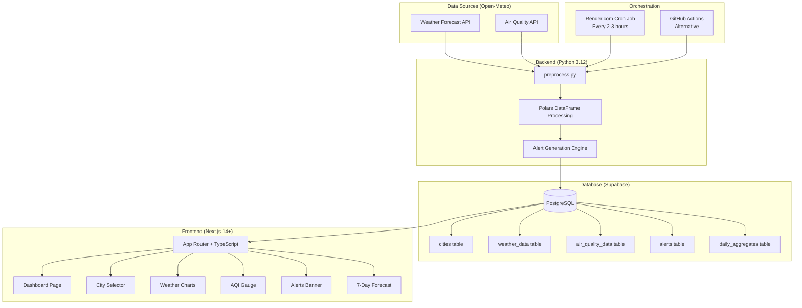

# 🚀 Rajasthan Weather & Air Quality Monitor

<div align="center">


*A beautiful, fast dashboard for live + forecasted weather and air quality data focused on Rajasthan, India*

</div>

---

## 📋 Table of Contents

- [Overview](#overview)
- [Architecture](#architecture)
- [Features](#features)
- [Tech Stack](#tech-stack)
- [Project Structure](#project-structure)
- [Local Development](#local-development)
- [Deployment Guide](#deployment-guide)
- [Environment Variables](#environment-variables)

---

## 🌤️ Overview

The **Rajasthan Weather & Air Quality Monitor** is a production-ready dashboard that automatically fetches, processes, and displays live + forecasted weather and air quality data for major Rajasthan cities (Jaipur, Jodhpur, Udaipur, Bikaner, Ajmer, Kota, and custom cities).

### Rajasthan-Specific Insights:
- 🔥 **Extreme Heat Alerts** (>42°C heatwave detection)
- 🏜️ **Dust Storm Monitoring** from Thar Desert
- 🌧️ **Monsoon Rainfall Tracking** with cumulative vs normal comparison
- 💨 **AQI Health Alerts** with PM2.5, PM10, and dust particles
- 📊 **Year-over-Year Comparison** for monsoon and heat patterns

---

## 🏗️ Architecture



---

## ✨ Features

| Feature | Description |
|---------|-------------|
| 🌡️ Live Weather | Real-time temperature, humidity, wind speed, precipitation |
| 📅 7-Day Forecast | Daily high/low, precipitation probability, weather codes |
| 💨 Air Quality | PM2.5, PM10, Dust, US AQI, European AQI gauges |
| 🔥 Heat Alerts | Automatic heatwave detection (>42°C) |
| 🏜️ Dust Storms | Thar Desert dust particle monitoring |
| 🌧️ Monsoon Tracker | Cumulative rainfall vs historical normal |
| 📱 PWA Support | Install as mobile app, works offline |
| 🌙 Dark Mode | Beautiful dark/light theme toggle |
| 🏙️ Custom Cities | Add any city by coordinates |
| 📊 Historical Comparison | Year-over-year weather pattern analysis |
| 🏥 Health Tips | AQI-based health recommendations |

---

## 🛠️ Tech Stack

| Layer | Technology |
|-------|-----------|
| **Data Source** | Open-Meteo APIs (Weather + Air Quality) |
| **Backend** | Python 3.12 + Polars + httpx |
| **Database** | Supabase PostgreSQL + RLS |
| **Frontend** | Next.js 14+ / App Router / TypeScript |
| **Styling** | Tailwind CSS + shadcn/ui |
| **Charts** | Recharts |
| **Deployment** | Vercel (frontend) + Render (cron) |

---

## 📁 Project Structure

```
14.WeatherAPI/
├── README.md
├── .env.example
├── backend/
│   ├── requirements.txt
│   ├── preprocess.py          # Main data pipeline script
│   ├── config.py              # Cities, API endpoints, constants
│   ├── render.yaml            # Render.com blueprint
│   └── Dockerfile             # Container for Render
├── database/
│   └── schema.sql             # Supabase schema + RLS policies
├── .github/
│   └── workflows/
│       └── fetch-weather.yml  # GitHub Actions alternative
└── frontend/
    ├── package.json
    ├── next.config.js
    ├── tailwind.config.ts
    ├── tsconfig.json
    ├── public/
    │   ├── manifest.json
    │   └── icons/
    ├── src/
    │   ├── app/
    │   │   ├── layout.tsx
    │   │   ├── page.tsx         # Main dashboard
    │   │   ├── globals.css
    │   │   └── api/
    │   │       └── refresh/
    │   │           └── route.ts
    │   ├── components/
    │   │   ├── CitySelector.tsx
    │   │   ├── CurrentConditions.tsx
    │   │   ├── ForecastCard.tsx
    │   │   ├── AQIGauge.tsx
    │   │   ├── AlertsBanner.tsx
    │   │   ├── WeatherCharts.tsx
    │   │   ├── MonsoonTracker.tsx
    │   │   ├── HealthTips.tsx
    │   │   ├── AddCityModal.tsx
    │   │   ├── ThemeToggle.tsx
    │   │   └── Header.tsx
    │   ├── lib/
    │   │   ├── supabase-server.ts
    │   │   ├── supabase-browser.ts
    │   │   ├── types.ts
    │   │   └── utils.ts
    │   └── hooks/
    │       └── useWeatherData.ts
    └── postcss.config.js
```

---

## 🖥️ Local Development

### Prerequisites
- Node.js 18+
- Python 3.12+
- Supabase account (free tier)

### 1. Clone & Setup
```bash
git clone <your-repo-url>
cd 14.WeatherAPI
```

### 2. Database Setup
1. Create a new project on [supabase.com](https://supabase.com)
2. Go to SQL Editor → Paste contents of `database/schema.sql` → Run
3. Copy your project URL and keys from Settings → API

### 3. Backend Setup
```bash
cd backend
python -m venv venv
venv\Scripts\activate  # Windows
pip install -r requirements.txt
cp ../.env.example .env
# Edit .env with your Supabase credentials
python preprocess.py
```

### 4. Frontend Setup
```bash
cd frontend
npm install
cp ../.env.example .env.local
# Edit .env.local with your Supabase credentials
npm run dev
```

Open [http://localhost:3000](http://localhost:3000) to see the dashboard!

---

## 🚀 Deployment Guide

### Step 1: Supabase (Database)
1. Go to [supabase.com](https://supabase.com) → New Project
2. Choose a region close to India (Mumbai if available)
3. Run `database/schema.sql` in SQL Editor
4. Note down: Project URL, anon key, service_role key

### Step 2: Render.com (Backend Cron)
1. Go to [render.com](https://render.com) → New → Cron Job
2. Connect your GitHub repo
3. Set Root Directory: `backend`
4. Set Build Command: `pip install -r requirements.txt`
5. Set Command: `python preprocess.py`
6. Set Schedule: `0 */2 * * *` (every 2 hours)
7. Add environment variables from `.env.example`

### Step 3: Vercel (Frontend)
1. Go to [vercel.com](https://vercel.com) → Import Git Repository
2. Set Root Directory: `frontend`
3. Add environment variables (NEXT_PUBLIC_ prefixed ones)
4. Deploy!

---

## 🔐 Environment Variables

See `.env.example` for all required variables.

| Variable | Used In | Description |
|----------|---------|-------------|
| `SUPABASE_URL` | Backend + Frontend | Your Supabase project URL |
| `SUPABASE_SERVICE_ROLE_KEY` | Backend ONLY | Service role key (never expose!) |
| `NEXT_PUBLIC_SUPABASE_URL` | Frontend | Public Supabase URL |
| `NEXT_PUBLIC_SUPABASE_ANON_KEY` | Frontend | Public anon key |

---

## 📄 License

MIT License — Feel free to use, modify, and distribute.

---

<div align="center">
  <strong>Built with ❤️ for Rajasthan</strong>
  <br>
  <sub>Powered by Open-Meteo • Supabase • Next.js • Python</sub>
</div>
